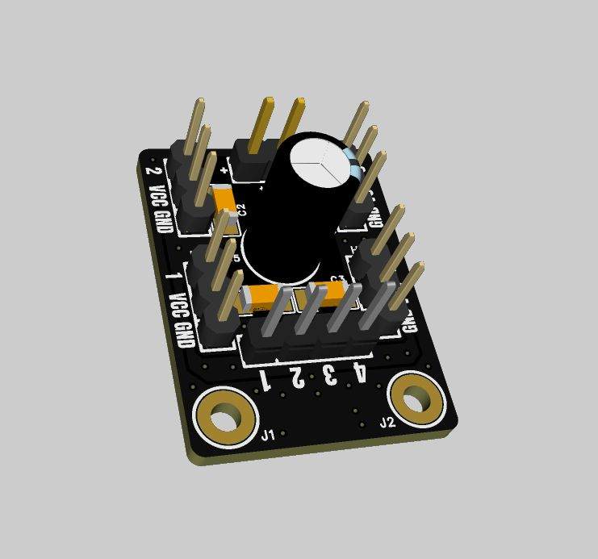
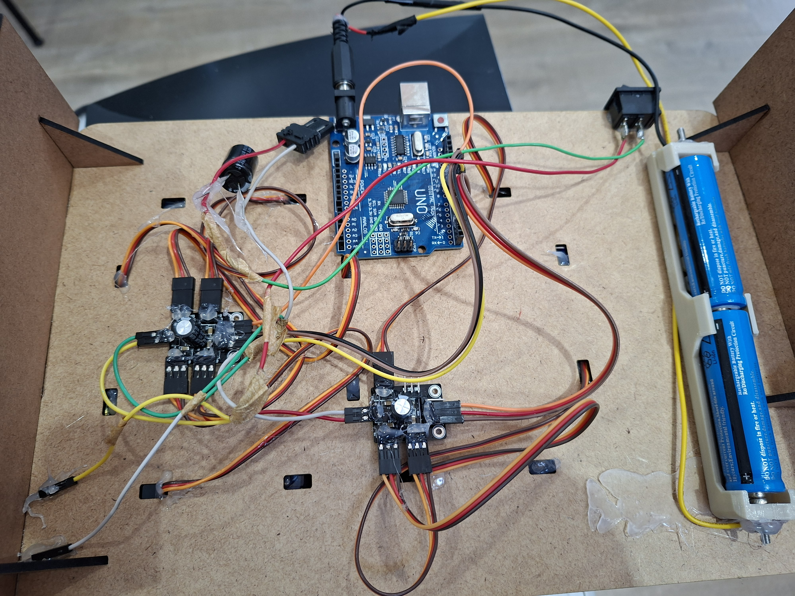
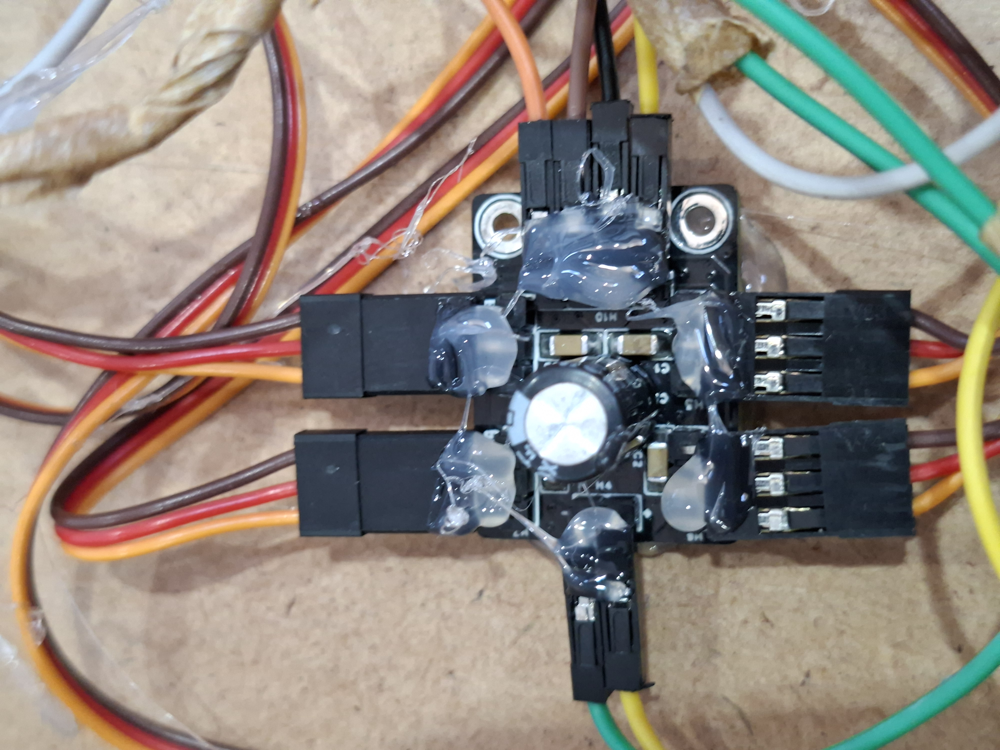

# easyServo

**easyServo** is a compact interface board (breakout board) designed to simplify the connection and control of up to 4 servomotores. This project was born from the need to "refactor the physical world," eliminating "spaghetti wiring" in prototypes and ensuring stable, safe power delivery for the motors.

---

## The Problem

In robotics and automation projects, powering multiple servos directly from an Arduino or ESP32's 5V pins is a common mistake. This leads to:

* **Instability:** Voltage drops that cause the microcontroller (MCU) to reset.
* **Signal Noise:** Interference in the PWM signals, causing "jitter" in the motors.
* **Hardware Risk:** Excessive stress on the MCU's internal voltage regulator.
* **Physical Mess:** Complex wiring that is difficult to troubleshoot on breadboards.

## The Solution

**easyServo** acts as a smart bridge between your logic and your actuators:

* **Power Isolation:** Servo power is supplied by a dedicated external source (batteries, switching power supplies, etc.).
* **MCU Protection:** The microcontroller only sends the logic signal (PWM), remaining isolated from high-current surges.
* **Signal Stability:** Traces are dimensioned for current flow, and the board layout is optimized for clean signals.
* **Connectivity:** Standard 3-pin headers for servos, enabling "plug & play" assembly.

---

## Technical Specifications

* **Channels:** Independent control for up to 4 servomotors.
* **External Input:** Terminal block input (supports 5V to 7.4V, depending on the servos used).
* **Compatibility:** Works with any microcontroller (Arduino, ESP32, Raspberry Pi Pico, etc.).
* **Design:** Designed in **EasyEDA PRO** with a focus on SMD components for a compact, professional footprint.

---

## Repository Structure

* 📁 **`/Hardware`**: Original EasyEDA pro project files.
* 📁 **`/Gerber`**: Production-ready files (tested and manufactured by **PCBWay**).
* 📁 **`/Docs`**: Schematic in PDF format and Bill of Materials (BOM).
* 📁 **`/Images`**: Photos of the assembled board and wiring diagrams.

---

## How to Manufacture

1. Download the `.zip` file from the `/Gerber` folder.
2. Upload the file to your preferred PCB manufacturer (e.g., **PCBWay**).
3. Use the BOM in the `/Docs` folder to order the components for SMD assembly.

---

## Real-World Use Case

This project was successfully validated in a **7-Segment Mechanical Display**. Two **easyServo** units were used in tandem with an **Arduino UNO** to coordinate the actuators, keeping the power stable and the wiring perfectly organized.

<video src="Images/output.mp4" width="100%" controls muted loop></video>

---

## License

This is an Open Source Hardware project under the [CERN-OHL-S-v2](LICENSE) license.

---
**Developed by Vinicius Hissayoshi Nishida** 
